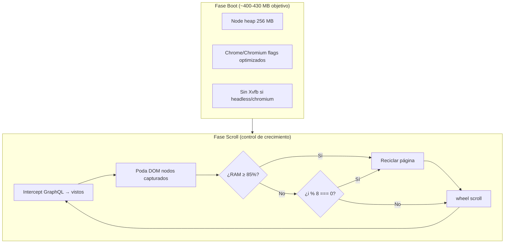

# 03 - Diseño — Propuesta Composer 2.5 (Estrategia G-Lite)

**Modelo:** Composer 2.5  
**Fecha:** 2026-08-07  
**Responde a:** `Mensajes entre modelos/08-Optimizacion-RAM-Render/2026-08-07_17-24-14_1-DEEPSEEK-planteo.md`

---

## 1. Visión general

**G-Lite** es un handler paralelo a G clásica. Mismo objetivo (scroll anónimo completo), distinta estrategia de extracción y gestión de memoria.

```
                    ┌─────────────────────────────────────┐
                    │         instagram-v2.ts             │
                    │         (orquestador)               │
                    └──────────────┬──────────────────────┘
                                   │
              ┌────────────────────┼────────────────────┐
              │ local / visible  │  nube / SCRAPER_MODE=glite
              ▼                  ▼
   scroll-anon-completo.ts   scroll-anon-graphql.ts  ← NUEVO
   (G clásica — NO TOCAR)    (G-Lite — Composer 2.5)
              │                  │
              └────────┬─────────┘
                       ▼
              Map<vistos> en Node (persistente)
                       │
         ┌─────────────┴─────────────┐
         ▼                           ▼
  extraerParesDOM (fallback)   GraphQL intercept (primario)
```

---

## 2. Arquitectura de memoria



---

## 3. Componentes nuevos y modificados

### 3.1 Nuevo: `scroll-anon-graphql.ts`

Handler autónomo. Estructura:

```typescript
// Pseudocódigo — ver 04-Codigo.md para detalle
export async function estrategiaScrollAnonimoGraphQL(ctx: ContextoScraping): Promise<Participante[]> {
  const vistos = new Map<string, Participante>();
  const page = /* contexto anónimo igual que G clásica */;
  await bloquearRecursosPesados(/* scope */);

  // Listener GraphQL (reutiliza extraerComentariosDeGraphQL)
  page.on('response', onGraphQLResponse → agregar(vistos));

  // Loop scroll (misma lógica wheel/rebote/reinicio que G)
  for (let i = 0; i < iteraciones; i++) {
    // 1. Fallback DOM solo si GraphQL sin progreso 2 ciclos
    if (sinProgresoGraphQL >= 2) agregar(extraerParesDOM(...));

    // 2. Poda DOM
    await podarDomCapturado(page, vistos);

    // 3. Reciclado adaptativo
    if (debeReciclar(i, memoriaContenedor())) await recargarPagina(...);

    // 4. Scroll
    await mouse.wheel(...);

    // 5. GC hint
    await page.evaluate(() => window.gc?.()).catch(() => {});

    logMemoria(`iter-${i}`);
  }
  return [...vistos.values()];
}
```

### 3.2 Modificado: `instagram-v2.ts`

Selección de estrategia G vs G-Lite:

```typescript
const esNube = process.env.RENDER === 'true' || process.env.SCRAPER_MODE === 'glite';
const fnScrollAnonimo = esNube
  ? estrategiaScrollAnonimoGraphQL
  : estrategiaScrollAnonimo;

// En array estrategias (sin sesión):
{ nombre: esNube ? 'Scroll anónimo G-Lite' : 'Scroll anónimo completo', fn: fnScrollAnonimo }
```

Selección tiered de navegador (solo nube):

```typescript
function resolverModoChrome(cantidadEsperada: number | null): 'chromium' | 'headless' | 'visible' {
  if (process.env.CHROME_MODE) return process.env.CHROME_MODE as ...;
  if (process.env.RENDER !== 'true') return 'visible';
  if (!cantidadEsperada || cantidadEsperada <= 300) return 'chromium';
  if (cantidadEsperada <= 800) return 'headless';
  return 'headless'; // posts grandes: headless + timeout + Apify fallback
}
```

### 3.3 Modificado: `memoria.ts`

```typescript
export interface MedicionMemoria {
  usadoMb: number;
  limiteMb: number;
  rssMb: number;
  porcentaje: number;      // usado/limite * 100
  margenMb: number;        // limite - usado
}

export function debeReciclarPorMemoria(umbral = 0.85): boolean {
  const m = memoriaContenedor();
  return m.limiteMb > 0 && m.usadoMb >= m.limiteMb * umbral;
}
```

### 3.4 Modificado: `Dockerfile`

```dockerfile
ENV NODE_OPTIONS=--max-old-space-size=256
ENV RENDER=true
ENV SCRAPER_MODE=glite
# CHROME_MODE se setea en Render dashboard según tier o dejar auto-tier
```

### 3.5 Nuevo helper: `podar-dom.ts`

```typescript
// api/src/collectors/strategies/lib/podar-dom.ts
export async function podarDomCapturado(
  page: Page,
  clavesCapturadas: Set<string> // "usuario|comentario" lowercase
): Promise<number> {
  return page.evaluate((claves) => {
    let removidos = 0;
    // Selectores IG desktop: lista de comentarios en sidebar
    const items = document.querySelectorAll(
      'ul ul > li, div[role="dialog"] ul > li, article ul > li'
    );
    for (const item of items) {
      const texto = (item.textContent || '').trim();
      if (texto.length < 10) continue;
      // Si el item parece ya capturado (heurística por username visible)
      const link = item.querySelector('a[href^="/"]');
      const user = link?.textContent?.trim().toLowerCase() || '';
      if (user && claves.has(user)) {
        item.remove();
        removidos++;
      }
    }
    return removidos;
  }, [...clavesCapturadas.keys()]);
}
```

> **Nota de diseño:** la poda usa heurística por username (no texto completo) para evitar `evaluate` con strings enormes. Se refina en implementación.

---

## 4. Flags Chrome adicionales (no probados aún)

Agregar a `ARGS_NAVEGADOR` **solo en modo nube/G-Lite**:

```typescript
const ARGS_NAVEGADOR_LITE = [
  ...ARGS_NAVEGADOR_BASE,
  '--renderer-process-limit=1',           // un solo renderer
  '--disable-features=site-per-process',  // menos procesos aislados
  '--disable-breakpad',                   // sin crash reporter
  '--disable-component-update',
  '--disable-default-apps',
  '--disable-domain-reliability',
  '--disable-sync',
  '--mute-audio',
  '--no-first-run',
  '--disable-hang-monitor',
  '--disable-prompt-on-repost',
  '--disable-client-side-phishing-detection',
  '--disable-popup-blocking',
  '--metrics-recording-only',
  '--force-color-profile=srgb',
];
```

**No agregar:** `--single-process`, `--disable-javascript` (rompe IG).

### Bloqueo de recursos extendido

Además de image/media/font, evaluar en G-Lite:

```typescript
case 'stylesheet':  // solo si GraphQL es primario y layout no se rompe
  return route.abort();
case 'websocket':
  return route.abort();
```

Activar con env `BLOCK_STYLES=1`; default off hasta validar.

---

## 5. Flujo de reciclado adaptativo

| Trigger | Condición | Acción |
|---------|-----------|--------|
| **T1 — Iteración** | `i > 0 && i % RECICLO_ITER === 0` | `recargarPagina('reciclado-iter')` |
| **T2 — Memoria** | `usadoMb >= limiteMb * 0.85` | `recargarPagina('reciclado-mem')` |
| **T3 — Estancamiento** | `sinProgreso >= tolerancia` | reinicio existente (igual G) |

Variables de entorno:

| Variable | Default nube | Default local |
|----------|--------------|---------------|
| `RECICLO_ITER` | 8 | 40 |
| `RECICLO_MEM_UMBRAL` | 0.85 | 0.95 |
| `RECICLO_MAX` | 12 | 8 |

Tras reciclado:
1. Re-registrar listener GraphQL en página nueva.
2. Re-aplicar `bloquearRecursosPesados`.
3. `goto(url)` + consentimiento + cerrar dialogs + scroll inicial.
4. `logMemoria('post-reciclado')`.

---

## 6. Flujo tiered completo (Render free)

```
POST /api/sorteos/analizar
        │
        ▼
obtenerCantidadComentarios(page) → N
        │
        ▼
┌───────────────────────────────────┐
│ N ≤ 300                           │
│   chromium + G-Lite               │
│   timeout: 90s                      │
└───────────────────────────────────┘
        │ falla umbral 50%
        ▼
┌───────────────────────────────────┐
│ 300 < N ≤ 800                     │
│   chrome headless + G-Lite        │
│   timeout: 120s                   │
└───────────────────────────────────┘
        │ falla umbral 50%
        ▼
┌───────────────────────────────────┐
│ N > 800                           │
│   G-Lite 60s → si <50% → Apify    │
└───────────────────────────────────┘
        │
        ▼
Retornar mejor resultado + logs MEM
```

---

## 7. UX — Progreso visual (AGENTS.md §8)

Durante G-Lite en nube, el endpoint ya es largo (~60–120s). Recomendación:

- Emitir logs estructurados `PROGRESS: { fase, capturados, esperados, memMb }` consumibles por el front en polling futuro.
- Corto plazo: mantener spinner existente en front; backend loguea cada 5 iteraciones.

---

## 8. Diagrama de secuencia (iteración G-Lite)

```
Orquestador          G-Lite              Chrome           Instagram
    │                   │                    │                  │
    │── invoke ────────►│                    │                  │
    │                   │── launch ─────────►│                  │
    │                   │── goto URL ───────►│── GET post ─────►│
    │                   │◄── GraphQL batch ──│◄─────────────────│
    │                   │── vistos += JSON   │                  │
    │                   │── podar DOM ──────►│                  │
    │                   │── wheel scroll ───►│── load more ────►│
    │                   │◄── GraphQL batch ──│◄─────────────────│
    │                   │── check MEM ───────│                  │
    │                   │── reciclar (if) ──►│ close/new page   │
    │◄── Participante[] │                    │                  │
```

---

## 9. Compatibilidad con flujos existentes

| Escenario | Handler | Navegador |
|-----------|---------|-----------|
| Dev local Windows | G clásica | Chrome visible |
| Render free post chico | G-Lite | Chromium headless |
| Render free post grande | G-Lite → Apify | Chrome headless → externo |
| Con sesión guardada | A→B→C→G (clásica o Lite según env) | Chrome visible local |
| Usuario pega cookies | headless forzado | Chrome headless |
