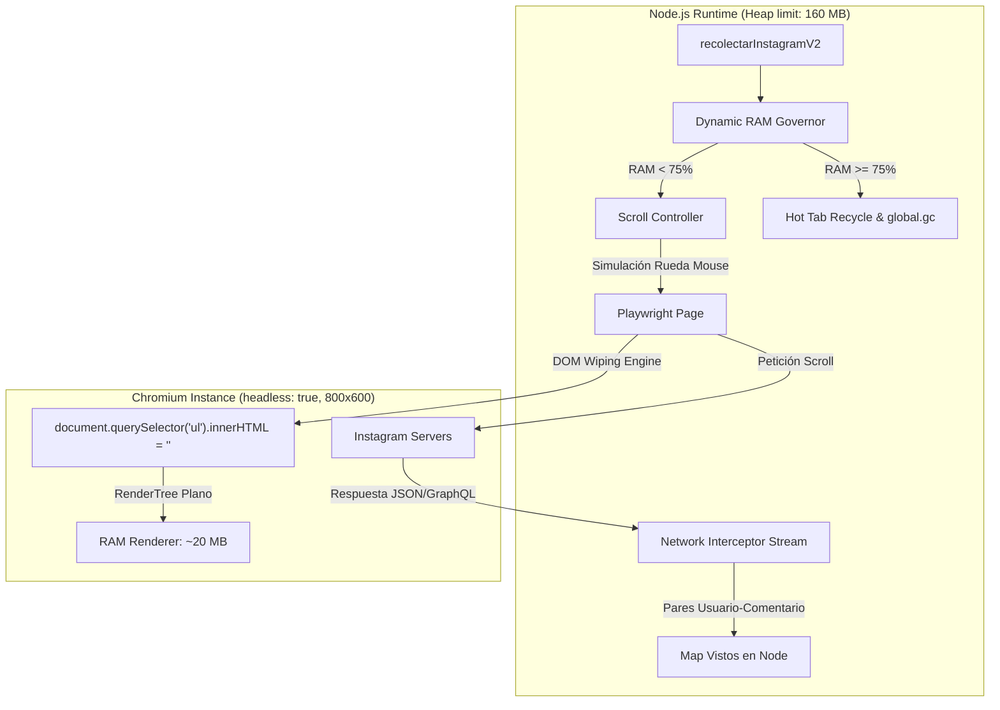
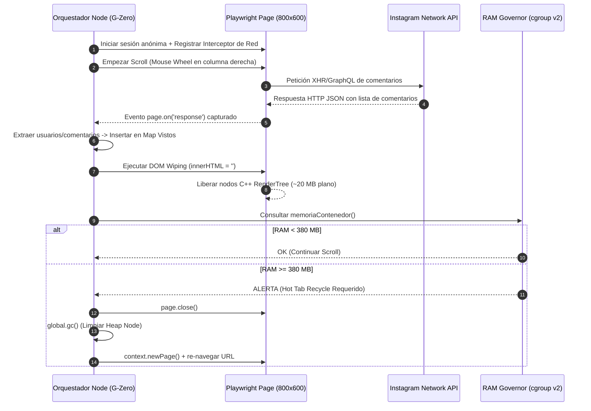

# Módulo 10: Optimización de RAM en Render (Plan Free 512 MB)
## Diseño de Arquitectura - Solución Gemini 3.6 (Estrategia G-Zero)

**Modelo:** Gemini 3.6  
**Fecha:** 2026-08-07  
**Estado:** Plan Actual - Diseño de Arquitectura  

---

## 1. Arquitectura General del Módulo G-Zero

La Estrategia **G-Zero (`scroll-anon-gzero.ts`)** introduce una arquitectura desacoplada basada en 4 pilares tecnológicos diseñados para operar de forma ultra-eficiente en entornos con restricciones severas de memoria RAM.



---

## 2. Componentes Clave de la Arquitectura

### 2.1 Network Response Interceptor Stream (Captura Directa de Red)
- En lugar de consultar el DOM del navegador en cada iteración mediante `page.evaluate()`, Playwright escucha directamente el evento `page.on('response')`.
- Cuando Instagram responde a las peticiones del scroll con payload JSON (endpoints `graphql/query` o `api/v1/media/.../comments/`), el interceptor en Node.js parsea las entidades de comentarios (`text`, `owner.username`, `created_at`) en tiempo real.
- Los comentarios capturados se insertan inmediatamente en el `Map<string, Participante>` residente en la memoria de Node.js.

### 2.2 Live DOM Wiping Engine (Vaciado de Nodos HTML en Vivo)
- Dado que los datos son capturados por el interceptor de red en tiempo real, mantener los elementos HTML en el navegador es completamente innecesario.
- Tras cada respuesta procesada o cada 3 ticks de scroll, se ejecuta en el contexto del navegador:
  ```javascript
  window.evaluate(() => {
    // Vaciar lista de comentarios manteniendo solo el contenedor raíz
    const container = document.querySelector('ul') || document.querySelector('article');
    if (container && container.children.length > 5) {
      container.innerHTML = ''; // Elimina el 100% de nodos de comentarios acumulados
    }
  });
  ```
- **Efecto:** El árbol C++ del RenderTree de Chromium se mantiene en un tamaño mínimo constante. El Renderer Process no supera los **25 MB de RAM** incluso después de 5.000 comentarios scrolleados.

### 2.3 Dynamic RAM Governor (Monitoreo Basado en cgroup v2)
- El Governor consulta periódicamente el helper `memoriaContenedor()`.
- **Reglas de Decisión:**
  - **Uso de RAM < 360 MB (70%):** Continuar scroll de alta velocidad.
  - **Uso de RAM >= 380 MB (75%):** Disparar **Hot Tab Recycle**:
    1. Cerrar la pestaña actual (`page.close()`).
    2. Invocar `global.gc()` en Node.js para purgar basura acumulada en el Heap de V8.
    3. Abrir pestaña limpia en el mismo contexto (`context.newPage()`).
    4. Re-navegar a la URL del post y reanudar el scroll.
  - **Uso de RAM >= 440 MB (85%):** Pausa preventiva de 3 segundos + invocación de `global.gc()`.

### 2.4 Profile de Lanzamiento Ultra-Bajo Consumo (Flags de Chromium + Viewport 800x600)
- **Viewport:** `800x600` (disminuye en 45% la memoria necesaria para buffers de pantalla y rasterizado).
- **Flags de Chromium Súper Agresivos:**
  ```typescript
  const ARGS_NAVEGADOR_GZERO = [
    '--disable-blink-features=AutomationControlled',
    '--window-size=800,600',
    '--disable-dev-shm-usage',
    '--no-sandbox',
    '--disable-gpu',
    '--disable-software-rasterizer',
    '--no-zygote',
    '--renderer-process-limit=1', // Limita a 1 solo proceso Renderer
    '--js-flags=--max-old-space-size=128 --no-opt', // Cota V8 interno de Chromium a 128MB
    '--disk-cache-size=1', // Minimiza cache HTTP en RAM
    '--media-cache-size=1',
    '--disable-extensions',
    '--disable-background-networking',
    '--disable-background-timer-throttling',
    '--disable-backgrounding-occluded-windows',
    '--disable-renderer-backgrounding',
    '--disable-ipc-flooding-protection',
    '--disable-features=Translate,BackForwardCache,MediaRouter,OptimizationHints,IsolateOrigins,site-per-process',
  ];
  ```

---

## 3. Flujo de Ejecución Detallado (Sequence Diagram)



---

## 4. Garantía de Compatibilidad y Respaldo Evasivo

1. **Preservación del Scroll Físico:** El scroll sigue realizándose mediante eventos reales de ratón (`page.mouse.wheel(0, 2200)`), asegurando que el motor JavaScript de Instagram continúe emitiendo las peticiones XHR/GraphQL legítimas con todos los tokens de seguridad requeridos.
2. **Fallback DOM Inteligente:** Si la respuesta de red viene encriptada o en un formato no parseable, el sistema realiza un fallback automático a extracción por DOM antes de ejecutar el DOM Wiping.
